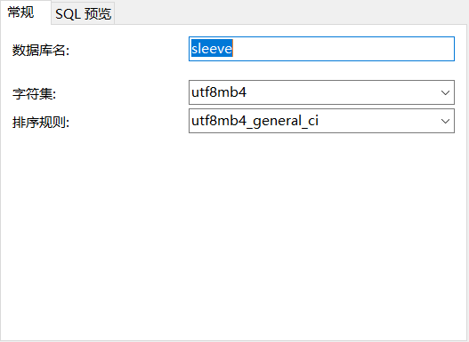
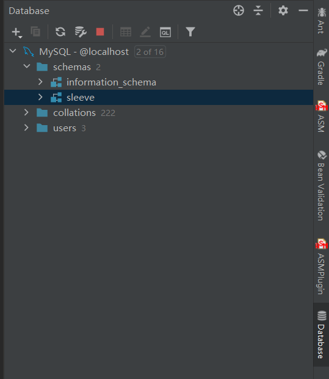
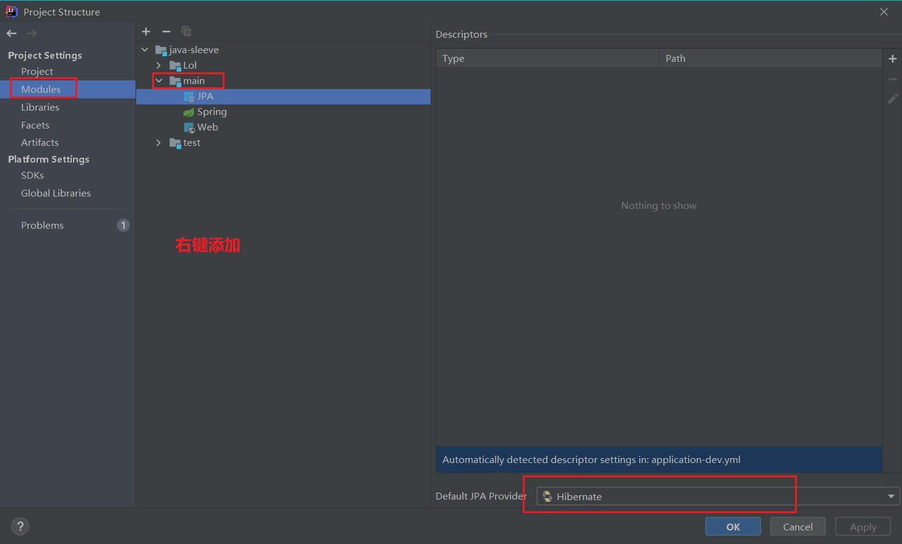
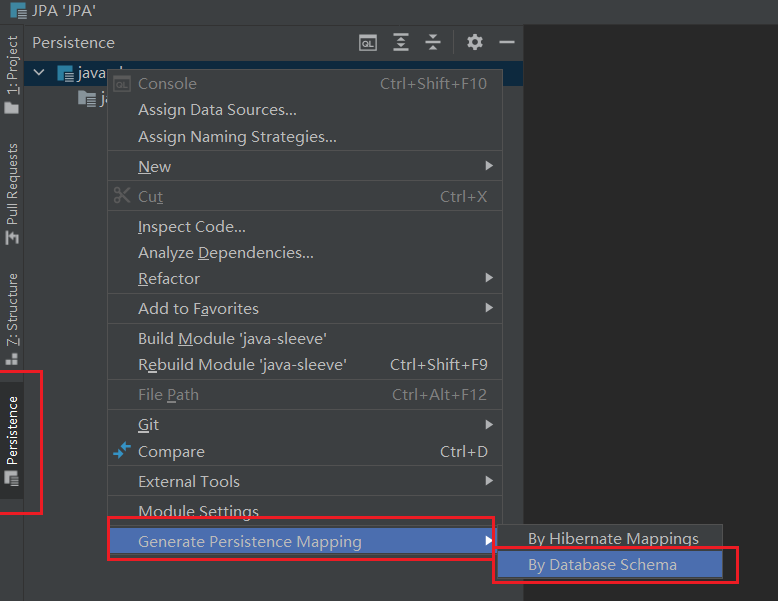
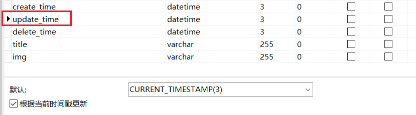

# part02-jpa_and_orm

## 1 JPA

### 创建数据库

使用 navicat：



连接数据库：

1. 可以将数据库地址等写在 properties 或 yml 文件中。
2. yml 文件的优先级更高，而且层级接口更加清晰。

### 如何创建数据表

1. 使用可视化工具。
2. 手写 SQL 语句，然后导入数据库。
3. 通过模型类生成数据库表。

常用可视化数据库工具：

1. navicat
2. mysql workbench
3. php admin

### 常用实体类注解与 ORM 生成表的优劣势

优势：

1. 自动生成表，很方便。

劣势：

1. 数据库各个字段的限制在实体类中的体现相对麻烦。
2. 表与表之间的关系，在实体类中的体现相对麻烦。

外键：

1. 物理外键。【一般不使用，使用 JPA 消除物理外键也是比较麻烦的】
2. 逻辑外键。

最有用的价值：

- 不是通过模型创建数据库。
- 而是**正确地配置实体与实体之间的关系**，从而提高开发效率。

### 表与表之间的关系

1. 一对一
2. 多对一
3. 多对多

**一对一有两方面考虑**：

1. 查询效率，一个表的字段不宜太多。
2. 业务角度，希望把数据拆分到不同业务表中。

**多对多**：

- 多对多的关系必须要有一张中间表来表示多对多的关系。
- 中间表不一定只有外键字段，也可以包含业务字段。

**JPA 创建表的控制**：

1. 如果没有设置外键，JPA 针对一对多的表情况，也会生成第三张表来维护表之间记录的关系。
2. Id 自增长，一般如果设计为整形，应该让其自增长。设置自增的注解是 `@GeneratedValue(strategy = GenerationType.IDENTITY)`，而不是 `GenerationType.AUTO`。AUTO 是让 JPA 自己去维护主键，一般不推荐。
3. 是否使用物理外键：
    1. 如果使用物理外键，可以强制维护数据的完整性。
    2. 不用物理外键，则便于表的升级与维护。【互联网项目一般更新变化比较大，不推荐使用物理外键，而是使用代码逻辑去维护数据的完整性】

### 数据库表的设计方法

1. 把表当作实体，面向对象设计。
2. 理清对象与对象之间的关系，表与表直接的关系通过外键实现。
3. 细化：字段限制、长度、小数点，唯一索引等。
4. 优化：表中的数据的极限量，不要超过 5000w 条，数据越多，查询越慢。优化方法：
    1. 查收方面 
        1. 建立索引。
        2. 水平分表：把一个表拆分成多张表。5000w 记录的表，拆分到 5 张表中，每张表就变成 1000w 记录。
        3. 垂直分割：一张表的字段太多也会影响查询效率，此时可以把字段太多的表拆分为多张表。
    2. 查询方面：通过查询方式优化，比如尽量少用 like。
    3. 缓存方面：避免少去查询数据库，比如查出的结果缓存到 Redis 中。

### 数据的查询

1. 通过 JPA 进行数据查询不需要写 sql 语句。
2. 测试环境下，需要配置查询时打印 sql 语句，以便于调试。
3. JPA 的多表查询默认是惰性查询的。通过配置 `OneToMany(fetch = FetchType.EAGER)` 可以改为一次性加载。

### 一对多的方向性

什么是导航属性：加上了 `OneToMany` 或 `ManyToOne` 的属性。

1. 单向一对多
    1. OneToMany
    2. ManyToOne
2. 双向一对多：【便于双向查询】
    1. 关系维护端是多端。
    2. 关系被维护端是一端。
    3. 双向关系里，JoinColumn 注解在多端 ManyToOne。
    4. 而在一端的 OneToMany 里，需要加上 `mappedBy = "多端导航属性名"`

单向一对多配置：

```java
@Entity
@Getter
@Setter
@ToString
public class Banner extends BaseEntity{

    @Id
    private Long id;

    private String title;
    private String name;
    private String description;

    private String img;

    @OneToMany(fetch = FetchType.LAZY)
    /*BannerItem 的 bannerId 字段*/
    @JoinColumn(name="bannerId")
    private List<BannerItem> items;

}

@Entity
@Getter
@Setter
@ToString
public class BannerItem extends BaseEntity{

    @Id
    private Long id;

    private String img;

    private String keyword;

    private short type;

    private String name;

    private Long bannerId;

}
```

单向多对一配置：

```java
@Entity
@Getter
@Setter
@ToString
public class Banner extends BaseEntity{

    @Id
    private Long id;

    private String title;
    private String name;
    private String description;

    private String img;

}

@Entity
@Getter
@Setter
@ToString
public class BannerItem extends BaseEntity{

    @Id
    private Long id;

    private String img;

    private String keyword;

    private short type;

    private String name;

    private Long bannerId;

    @ManyToOne(fetch = FetchType.LAZY)
    /*BannerItem 的 bannerId 字段*/
       @JoinColumn("bannerId")
    private Banner banner;

}
```


双向多对一配置：

```java
@Entity
@Getter
@Setter
@ToString
public class Banner {

    @Id
    @GeneratedValue(strategy = GenerationType.IDENTITY)//自增，不建议使用 AUTO
    private long id;

    @Column(length = 16)
    private String name;

    private String description;

    private String img;

    private String title;

    @OneToMany(mappedBy = "banner"/*banner 是 BannerItem 中，Banner 类型的属性名 */)
    private List<BannerItem> items;

}

@Entity
@Getter
@Setter
@ToString
public class BannerItem {

    @Id
    @GeneratedValue(strategy = GenerationType.IDENTITY)//自增，不建议使用 AUTO
    private Long id;

    private Long bannerId;

    private String img;

    /**
     * spu id
     */
    private String keyword;

    /**
     * 跳转类型
     */
    private Short type;

    private String name;

    @ManyToOne
    @JoinColumn(name = "bannerId")
    private Banner banner;

}
```

上面 BannerItem 中其实有多余的配置，而且在 JPA 创建表时会报错，因为指定了双向关系后，外键 `banner_id` 将由 JPA 自动生成，而不用开发者去指定，因此 BannerItem 可以简化为：

```java
@Entity
@Getter
@Setter
@ToString
public class BannerItem {

    @Id
    @GeneratedValue(strategy = GenerationType.IDENTITY)//自增，不建议使用 AUTO
    private Long id;

    private String img;

    /**
     * spu id
     */
    private String keyword;

    /**
     * 跳转类型
     */
    private Short type;

    private String name;

    @ManyToOne
    private Banner banner;

}
```

如果确实有需求要在模型中保留 bannerId 字段，则有两种方式：

1. 改回单向一对多。
2. 继续使用双向一对多，在 `@JoinColumn(name = "bannerId")` 添加两个参数 `@JoinColumn(name = "bannerId", insertable = false,updatable = false)`。

### 不通过实体创建表

1. ORM 的本质不是根据实体来创建表。
2. 实体的主要作用是用来表达数据结构，用来表示数据库数据。
3. 使用 ORM 并不一定就要通过实体来创建数据表。
4. ORM 核心是用实体去操作数据库对象，用实体去表达数据库数据。

### 多对多的方向性

**单向多对多**：

1. 单向多对多有一定意义。
2. 单向多对多只需要一方存在导航属性。

下面，Theme 是关系维护方：

```java
@Entity
@Getter
@Setter
@ToString
public class Spu {

    @Id
    private Long id;

    private String title;
    private String name;
    private String subTame;

}

@Entity
@Getter
@Setter
@ToString
public class Theme {

    @Id
    private Long id;

    private String title;
    private String name;

    @ManyToMany
    /*JoinTable 用于规范关系表*/
    @JoinTable(
            name = "theme_spu",
            joinColumns = @JoinColumn(name = "theme_id"),
            inverseJoinColumns = @JoinColumn(name = "spu_id")
    )
    private List<Spu> spuList;

}
```

**双向多对多**：

```java
@Entity
@Getter
@Setter
@ToString
public class Spu {

    @Id
    private Long id;

    private String title;
    private String name;
    private String subTame;

    /*关系被维护端，通过 mappedBy 指定关系维护段字段。*/
    @ManyToMany(mappedBy = "spuList")
    private List<Theme> themeList;

}

@Entity
@Getter
@Setter
@ToString
public class Theme {

    @Id
    private Long id;

    private String title;
    private String name;

    @ManyToMany
    /*JoinTable 用于规范关系表*/
    @JoinTable(
            name = "theme_spu",
            joinColumns = @JoinColumn(name = "theme_id"),
            inverseJoinColumns = @JoinColumn(name = "spu_id")
    )
    private List<Spu> spuList;

}
```

通过观察可以发现，定义了 mappedBy 的就是关系被维护端。关系被维护端与关系维护端对于查询来说没有什么意义，但是对于更新与删除有关系，但不推荐使用 JPA 去做删除或更新，因为涉及到级联操作问题，级联操作中还涉及到`去孤子`问题，另外现在的互联网项目一般都不会去物理删除数据，只是逻辑上去删除，因为数据本身也是很重要的。

### 禁用 JPA 生成物理外键

>以上面双向一对多为例。

方式1：使用 `org.hibernate.annotations.ForeignKey` 配置禁用物理外键。

```java
@Entity
@Getter
@Setter
@ToString
public class Banner {

    @Id
    @GeneratedValue(strategy = GenerationType.IDENTITY)//自增，不建议使用 AUTO
    private long id;

    @Column(length = 16)
    private String name;

    private String description;

    private String img;

    private String title;

    @OneToMany
    //@JoinColumn(name = "bannerId"/*BannerItem 的 bannerId 字段*/)
    @ForeignKey(name = "null")
    private List<BannerItem> items;

}
```

方式2：使用 `@JoinColumn(foreignKey = @ForeignKey(value = ConstraintMode.NO_CONSTRAINT) ... )` 配置禁用物理外键。

```java
@Entity
@Getter
@Setter
@ToString
public class BannerItem {

    @Id
    @GeneratedValue(strategy = GenerationType.IDENTITY)//自增，不建议使用 AUTO
    private Long id;

    private String img;

    /**
     * spu id
     */
    private String keyword;

    /**
     * 跳转类型
     */
    private Short type;

    private String name;

    @ManyToOne
    @JoinColumn(foreignKey = @ForeignKey(value = ConstraintMode.NO_CONSTRAINT),name = "bannerId", insertable = false,updatable = false)
    private Banner banner;

}
```

**但是在实际开发中，我们一般不会使用 JPA 自动生成表，也不会用到以上功能**。

## 2 ORM

### ORM 介绍

ORM 是用面向对象的角度去看到数据库，即 `Object Relation Mapping`。

数据库的两个特点：

1. 存储数据。
2. 表示数据与数据之间的关系。

数据库的这两个特点整个契合面向对象的思想。另外 ORM 的加价值并不是根据数据模型去生成数据库表，而是通过模型去操作数据。相反，一般使用使用 `可视化工具（比如 navicat）` 来创建数据库表，然后反向通过表生成 Model。

如果要禁用 JPA 根据模型生成数据表，配置一下即可：

```yml
spring:
  profiles:
    active: dev
  jpa:
    hibernate:
      ddl-auto: none #不让 JPA 自己创建数据表。
```

### 通过 navicat 创建表

可以在模型面板中创建数据表。

1. 可以将数据库中所有的表和数据转储到文件。
2. 也可以将 sql 文件导入到数据库。

### 根据数据表创建模型

1 IDEA 建立中建立 MySQL 连接



2 添加 JPA 模块



3 Generate Persistence Mapping



### 每一条数据的创建、更新、删除时间

现在的互联网项目，一般每个业务表中都会有三个字段：

```java
private Date createTime;//创建时间
private Date updateTime;//更新时间
private Date deleteTime;//删除时间（软删除）
```

可以使数据库自己去维护这三个字段的更新。

1. 设置 createTime 的默认值为 `CURRENT_TIMESTAMP`，不随着操作更新。
2. 设置 updateTime 的默认值为 `CURRENT_TIMESTAMP`，随着操作更新。
3. 设置 deleteTime 的默认值为 `null`，不随着操作更新，当 deleteTime 有值时，就表示该数据已经被删除了。



### 关于数据库的扩展

1. 斟酌字段的意义，有没有可能表中某个字段类型会有多个，如果有，是否可以拆分出一张表。
2. 列不具备扩展性，但是行可以随意新增。尽可能把变动放在行上。
3. 灵活应用配置表。
4. 使用复合字段，比如字段中存储 json 或可拆分的字符串。

### 3 查询

是否使用关联查询 join：

1. 有些公司规定一次查询不能超过 3 次 join。
2. 有些公司严禁使用 join，所有的查询都拆分为单表查询，然后使用 Java 的逻辑代码去做过滤。【好处的查询速度非常块】

使用 JPA 的导航属性和 JPQL 可以大大简化查询操作。【实体是客观存在的，导航属性是主观存在的，导航属性不影响表的结构】

另外：JPA 非常适合做单表查询，由于现在微服务的流行，一定程度上隔离了复杂业务，所以 JPA 的使用变得广泛。
